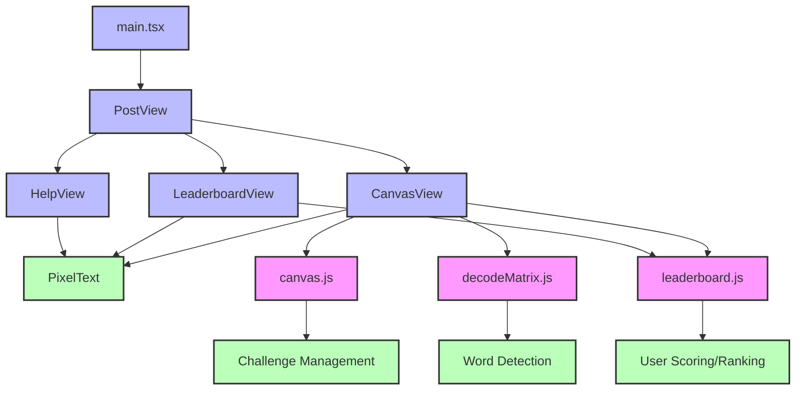
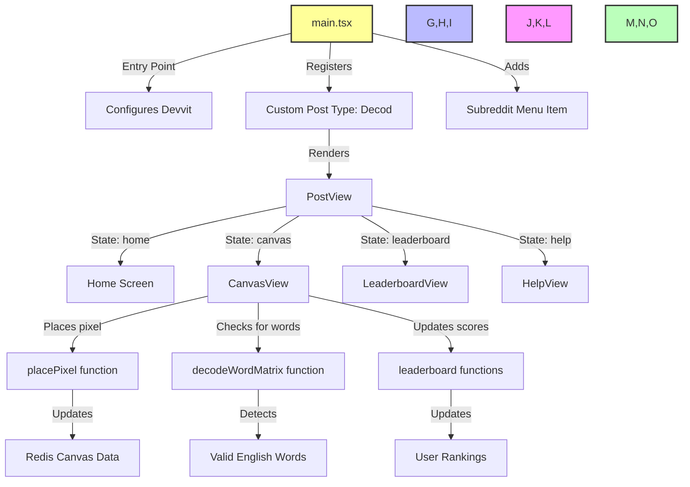
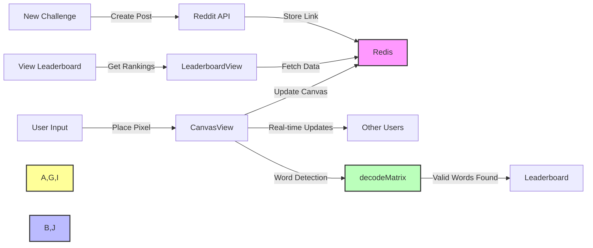

# Decod 2D matrix

## How to run
First, you need to install devvit [instructions here](https://developers.reddit.com/docs/quickstart)

```bash
# login first
devvit login

# clone this repo
git clone https://github.com/bm777/decod.git
cd decod

# upload the app
devvit upload

# playtest the app
devvit playtest <name>
```

### Hierarchy diagram



### Functional diagram 



### Data flow diagram



### main Tech Stack
