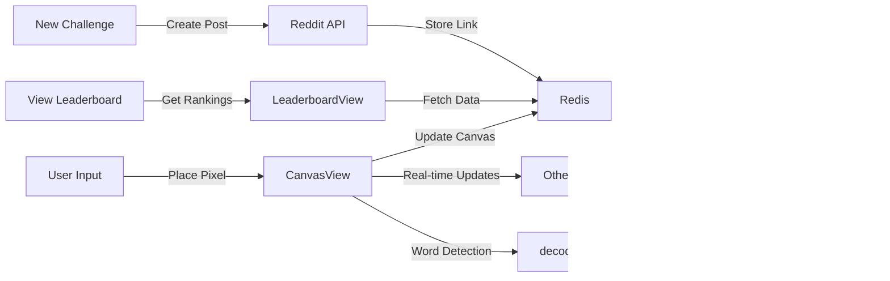

# Decod 2D matrix

### preview


you can play here: [r/decod](https://www.reddit.com/r/decod/)

## How to run
First, you need to install devvit [instructions here](https://developers.reddit.com/docs/quickstart)

```bash
# login first
devvit login

# clone this repo
git clone https://github.com/bm777/decod.git
cd decod

# upload the app
devvit upload

# playtest the app
devvit playtest <name>
```

### Technical Explanation: Matrix to Words Conversion

The game converts a 21x21 binary matrix (grid of 0s and 1s) into readable text through the following process:

1. **Bit Reading**: The matrix is read in row-major order (left-to-right, top-to-bottom), treating each cell as a single bit.

2. **Character Encoding**: Every 5 bits are grouped together to form a 5-bit integer (0-31), which maps to a character in our custom 32-character alphabet:
   - The alphabet consists of: `AABCDEEFGHIIJKLMNOOPQRSTUU VWXYZ `
   - This allows us to represent all 26 English letters plus spaces efficiently

3. **Word Formation**: The resulting character stream is processed by:
   - Removing spaces
   - Splitting the text into random chunks (segments of length 2-7)
   - Identifying segments longer than 3 characters

4. **Word Validation**: Each identified segment is checked against an English dictionary to determine if it's a valid word.

5. **Scoring**: Valid English words found in the matrix contribute to the player's score in the game.

### Character to Binary Mapping

The following table shows how each character is encoded using 5 bits:

| Character | Binary | Decimal |   | Character | Binary | Decimal |
|-----------|--------|---------|---|-----------|--------|---------|
| A         | 00000  | 0       |   | P         | 10000  | 16      |
| A         | 00001  | 1       |   | Q         | 10001  | 17      |
| B         | 00010  | 2       |   | R         | 10010  | 18      |
| C         | 00011  | 3       |   | S         | 10011  | 19      |
| D         | 00100  | 4       |   | T         | 10100  | 20      |
| E         | 00101  | 5       |   | U         | 10101  | 21      |
| E         | 00110  | 6       |   | U         | 10110  | 22      |
| F         | 00111  | 7       |   | [space]   | 10111  | 23      |
| G         | 01000  | 8       |   | V         | 11000  | 24      |
| H         | 01001  | 9       |   | W         | 11001  | 25      |
| I         | 01010  | 10      |   | X         | 11010  | 26      |
| I         | 01011  | 11      |   | Y         | 11011  | 27      |
| J         | 01100  | 12      |   | Z         | 11100  | 28      |
| K         | 01101  | 13      |   | [space]   | 11101  | 29      |
| L         | 01110  | 14      |   |           | 11110  | 30      |
| M         | 01111  | 15      |   |           | 11111  | 31      |

### Frequency Optimization

Notice that vowels (A, E, I, O, U) are repeated in our encoding scheme. This is intentional and serves a crucial purpose:

- **Vowel Frequency**: In the English language, vowels appear more frequently than most consonants. By doubling vowels in our encoding, we increase the probability of generating vowels when decoding random bit patterns.

- **Word Formation**: This frequency optimization makes it more likely that random pixel patterns will decode into valid English words, as most English words require vowels.

- **Gameplay Balance**: The encoding is designed to create a balance where player-placed pixels have a reasonable chance of forming recognizable words while still presenting a challenge.

This frequency-adjusted encoding is what makes the game both challenging and rewarding, as players learn to strategically place pixels to maximize their chances of forming high-scoring words.

### Hierarchy diagram


### Functional diagram 


### Data flow diagram


